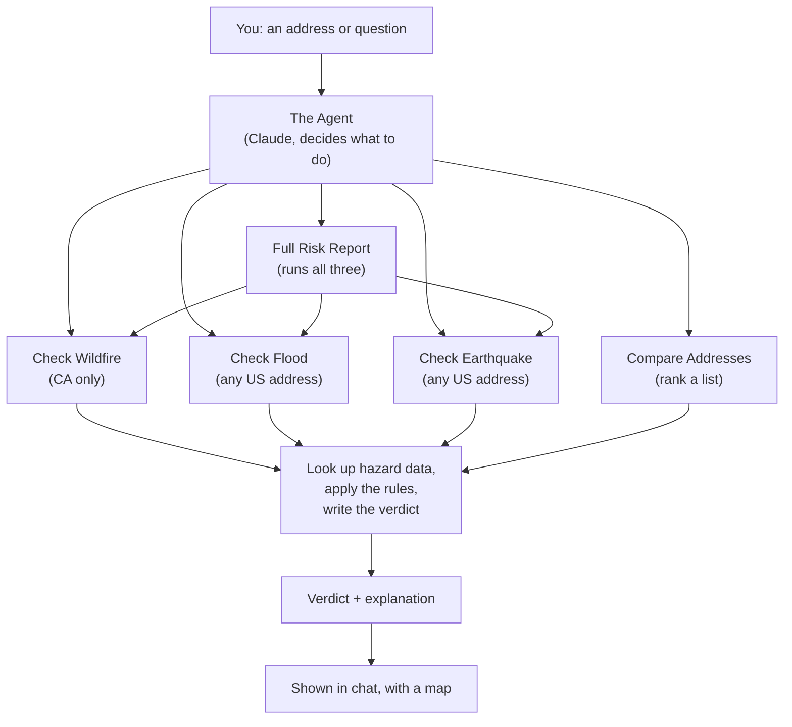

# Insurability Triage Agent

## The problem

Wildfire, flood, and earthquake risk can make a home hard to insure — but
finding that out today means checking CAL FIRE, FEMA, and USGS maps
separately, then figuring out what the rules actually mean for
insurability.

## Who it helps

Real estate agents and title companies who need a quick, plain-English
answer before a deal moves forward: is this property going to be hard to
insure, and what would fix it?

## What it does

Give it an address (or ask a question) and it checks:

- **Wildfire** — California only. Also tells you what mitigation (like
  clearing brush) would improve the outcome.
- **Flood** — any US address. Based on FEMA flood zones.
- **Earthquake** — any US address. Based on seismic building codes.

It can check one address, compare several, scan a whole listing book, or
answer open questions about a location (schools, amenities, etc). Results
show on a map, and you can ask "what if" questions to see how mitigation
changes the verdict.

It's a real **agent** — built on Claude with tool use — so it decides what
to check and how to answer based on what you ask, rather than following a
fixed script.

```
insurability-triage-agent/
├── backend/     Python — agent, scorer, Mireye client, hazard tools, FastAPI wrapper
└── frontend/    Next.js — chat UI (primary demo path)
```

## Setup

```bash
cd backend
python3 -m venv .venv
source .venv/bin/activate
pip install -r requirements.txt
cp .env.example .env   # fill in MIREYE_API_TOKEN (required) and ANTHROPIC_API_KEY (optional)
```

`ANTHROPIC_API_KEY` powers the agent's reasoning. Without it, the hazard
checks still work, but you get plain-text output instead of an
LLM-written summary.

## Run the web UI (primary demo path)

Two terminals, from the repo root:

```bash
# Terminal 1 — backend
cd backend
source .venv/bin/activate
uvicorn api.main:app --reload --port 8000

# Terminal 2 — frontend
cd frontend
npm run dev
```

Open http://localhost:3000. `frontend/.env.local` already points at
`http://localhost:8000`.

## Run the agent as a CLI (no browser)

```bash
cd backend
source .venv/bin/activate
python -m agent.agent
```

```
> Is 5555 Skyway, Paradise, CA 95969 going to be hard to insure?
> What if the defensible space is already cleared?
> Can you check my listing book and rank them by risk?
> Give me the full risk picture for 100 Ocean Dr, Miami Beach, FL 33139
> Is that address in a flood zone that requires mandatory insurance?
```

## Run the tests

```bash
cd backend
source .venv/bin/activate
pytest -v
```

## Scope (v1)

Wildfire checks are California only. Flood and earthquake checks work
nationwide.

## How it works

One agent, one reasoning loop. It doesn't run three separate agents — it
just has three hazard checks (plus a couple of helper tools) it can pick
from, and it decides which ones to use.



Every hazard check follows the same three steps: look up the data, apply
a fixed set of rules to score it, then explain the verdict in plain
language. Adding a new hazard later just means plugging into that same
pipeline.

Two ways to use it, same logic underneath:

- **Web UI** (`frontend/` + `backend/api/`) — the chat interface, and the
  primary way to demo this.
- **CLI** (`backend/agent/agent.py`) — the same agent, runnable directly
  in a terminal.
